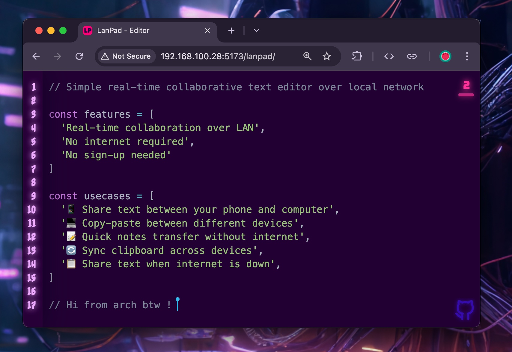

<div align="center">
    
    <h3>LanPad</h3>
    <h4>
      Simple real-time collaborative text editor over local network
    </h4>
    
</div>

---

## Features

- Real-time collaboration over LAN
- No internet required
- No sign-up needed
- ~~Simple room-based sharing~~

## Quick Start

1. Clone the repository:
   ```bash
   git clone https://github.com/metaory/lanpad.git
   cd lanpad
   ```

2. Install dependencies:
   ```bash
   npm install
   ```

3. Start the server:
   ```bash
   npm run dev
   ```

4. Open your browser and visit:
   ```
   http://localhost:5173
   ```

5. Share your local IP address with others on the same network:
   ```
   http://YOUR_LOCAL_IP:5173
   ```

## Use Cases

- 📱 Share text between your phone and computer
- 💻 Copy-paste between different devices
- 📝 Quick notes transfer without internet
- 🔄 Sync clipboard across devices
- 📋 Share text when internet is down

## Limitations

- Requires all users to be on the same local network
- No file upload/download
- No data persistence
- ~~Anyone with the room name can join~~

## License
[MIT](LICENSE)